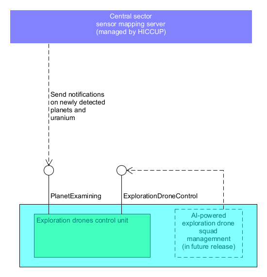
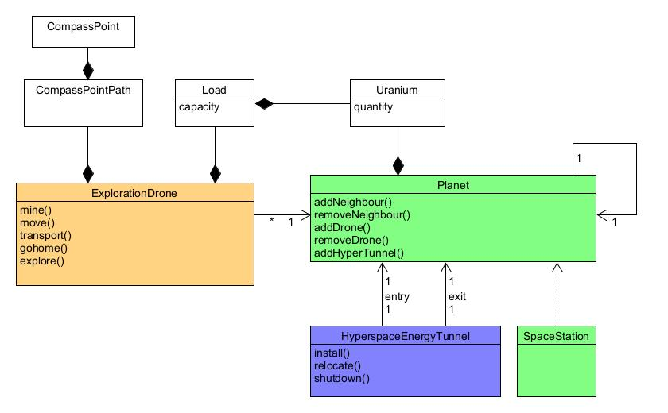

# 🌌 Space Exploration Drone Control System

## 🚀 Overview
In the year 2127, the **High Command Control of the Universe and Planets** (HICCUP) governs interstellar exploration and drone fleets across planetary sectors.  
This project delivers a full system to **manage exploration drones**, **mine uranium**, **discover new planets**, and **teleport via hyperspace tunnels**.

HICCUP has established a **certification process** for software systems, ensuring quality and compliance. This system was developed following **Clean Code**, **SOLID principles**, and a **Domain-Driven Design (DDD)** architecture.

- 
---

## 🧩 Domain Entities

| Entity | Description |
|--------|-------------|
| **Planet** | A planet that can be regular or a Space Station. It holds drones, uranium, neighbors, and hyperspace tunnels. |
| **ExplorationDrone** | An autonomous exploration drone that can move, mine, explore, and transport through tunnels. |
| **HyperspaceEnergyTunnel** | A unidirectional hyperspace tunnel connecting two planets for instant drone transport. |

---

## 📏 Business Rules

- **Movement Constraints**:
    - Drones can move only north, south, east, or west if the neighboring planet exists.
    - Drones cannot pass sector borders or enter energy fields.

- **Mining Fairness**:
    - The drone with the least uranium load mines first.
    - Drones can mine as much uranium as their capacity allows.
    - Mining by the wrong drone throws a `ExplorationDroneControlException`.

- **Hyperspace Tunnels**:
    - Only one hyperspace tunnel per entry planet.
    - Entry and exit planets must be different.
    - Transport through tunnels is instantaneous and one-way.

- **Command History**:
    - Every executed command (even failed ones) is recorded in each drone’s history.
    - Drones have unique names for ASPCR compliance.

---

## 🛠 System Features

- Grid-based planet navigation (N/E/S/W movement).
- Smart uranium mining with capacity and fairness control.
- Hyperspace energy tunnels for teleporting across planets.
- RESTful API interface for drone, planet, and tunnel management.
- Full command history tracking for exploration drones.

---

## 🛠 System Architecture

- 
---

## 🧱 Technology Stack

- **Backend**: Java 21, Spring Boot
- **Persistence**: JPA / Hibernate with H2 Database
- **API**: RESTful JSON over HTTP
- **Build Tool**: Gradle
- **Testing**: JUnit 5, Mockito

---

## 🌐 REST API Overview

### Drone Management
| Endpoint | Method | Description |
|----------|--------|-------------|
| `/drones` | `GET` | List all drones |
| `/drones` | `POST` | Create new drone |
| `/drones/{drone-id}` | `GET` | Get specific drone |
| `/drones/{drone-id}` | `DELETE` | Delete a drone |
| `/drones/{drone-id}/commands` | `POST` | Send command to drone |
| `/drones/{drone-id}/commands` | `GET` | Retrieve command history |

### Planet Management
| Endpoint | Method | Description |
|----------|--------|-------------|
| `/planets` | `GET` | List all planets |
| `/planets/{planet-id}` | `GET` | Get planet details |
| `/planets/{planet-id}/replenish` | `POST` | Add uranium to planet |

### Hyperspace Tunnel Management
| Endpoint | Method | Description |
|----------|--------|-------------|
| `/tunnels` | `POST` | Install new tunnel |
| `/tunnels` | `GET` | List all tunnels |
| `/tunnels/{tunnel-id}` | `GET` | Get tunnel details |
| `/tunnels/{tunnel-id}` | `DELETE` | Shutdown tunnel |
| `/tunnels/{tunnel-id}/relocate` | `PUT` | Relocate tunnel |

---

## 📚 Development Principles

This project strictly follows:
- **Clean Code** principles for readability and maintainability.
- **SOLID** object-oriented design principles.
- **Domain-Driven Design (DDD)** methodology.
- **Layered Architecture**: clear separation of domain, application, infrastructure, and interfaces.

---

## ⚖ License

All rights reserved by the author, **Abolfazl Heidari**.

