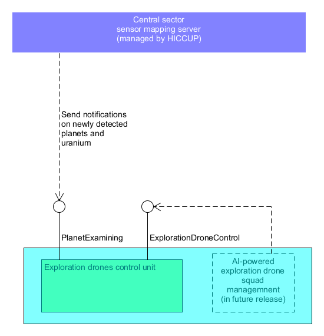
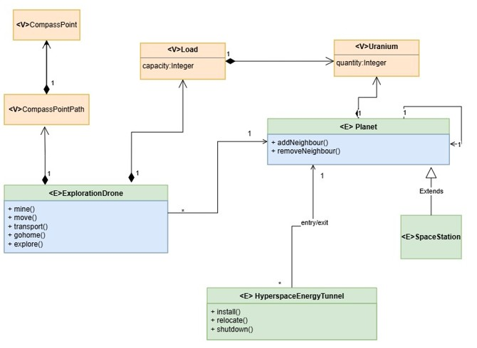

# 🌌 Space Exploration Drone Control System

## 🚀 Overview

In the year 2127, the **High Command Control of the Universe and Planets** (HICCUP) governs interstellar exploration and drone fleets across planetary sectors.  
This project delivers a full system to **manage exploration drones**, **mine uranium**, **discover new planets**, and **teleport via hyperspace tunnels**.

HICCUP has established a **certification process** for software systems, ensuring quality and compliance. This system was developed following **Clean Code**, **SOLID principles**, and a **Domain-Driven Design (DDD)** architecture.



*The landscape illustrates the relationship between the exploration drone controller and external HICCUP systems.*

The application is responsible for its own domain model and business logic, while external certification contracts are kept outside the domain model.

---

## 🧩 Domain Entities

| Entity | Description |
|--------|-------------|
| **Planet** | A planet that can be regular or a Space Station. It holds drones, uranium, neighbors, and hyperspace tunnels. |
| **ExplorationDrone** | An autonomous exploration drone that can move, mine, explore, and transport through tunnels. |
| **HyperspaceEnergyTunnel** | A unidirectional hyperspace tunnel connecting two planets for instant drone transport. |

---

## 📏 Business Rules

- **Movement Constraints**:
  - Drones can move only north, south, east, or west if the neighboring planet exists.
  - Drones cannot pass sector borders or enter energy fields.

- **Mining Fairness**:
  - The drone with the least uranium load mines first.
  - Drones can mine as much uranium as their capacity allows.
  - Mining by the wrong drone throws a `ExplorationDroneControlException`.

- **Hyperspace Tunnels**:
  - Only one hyperspace tunnel per entry planet.
  - Entry and exit planets must be different.
  - Transport through tunnels is instantaneous and one-way.

- **Command History**:
  - Every executed command (even failed ones) is recorded in each drone's history.
  - Drones have unique names for ASPCR compliance.

---

## 🛠 System Features

- Grid-based planet navigation (N/E/S/W movement).
- Smart uranium mining with capacity and fairness control.
- Hyperspace energy tunnels for teleporting across planets.
- RESTful API interface for drone, planet, and tunnel management.
- Full command history tracking for exploration drones.


## 🏛️ System Architecture



---


### Anti-Corruption Layer (ACL)

The system includes an **Anti-Corruption Layer** that protects the domain from external interfaces:

### Why an Anti-Corruption Layer?

| Purpose | Description |
|---------|-------------|
| **Domain Protection** | Prevents external interfaces from leaking into the domain model |
| **HICCUP Compliance** | Implements required certification interfaces without polluting domain logic |
| **Separation of Concerns** | External requirements change independently from business rules |
| **Ubiquitous Language** | Maintains domain language separate from external language |

### What's NOT in the Domain

The certification interfaces (`certification` package) are kept outside the domain because:
1. They represent external requirements, not business logic
2. They use HICCUP's language, not our ubiquitous language
3. They can change independently from our domain
4. The domain should remain pure and focused on business rules

---

## 🧱 Technology Stack

- **Backend**: Java 26, Spring Boot 4.1.1
- **Persistence**: JPA / Hibernate with **PostgreSQL**
- **Containerization**: Docker & Docker Compose
- **API**: RESTful JSON over HTTP
- **Build Tool**: Gradle
- **Testing**: JUnit 5, Mockito
- **API Documentation**: OpenAPI 3.0 (Swagger)
- **Code Quality**: Lombok

---

## 🐳 Docker Setup

### Prerequisites

- Docker & Docker Compose installed on your system

### Running with Docker Compose

```bash
# Clone the repository
git clone https://github.com/neotee314/exploration-drone-controller.git
cd exploration-drone-controller

# Build the application
./gradlew clean build

# Start the application with PostgreSQL
docker-compose up -d

# Stop the application
docker-compose down

# View logs
docker-compose logs -f

# Rebuild and restart
docker-compose up -d --build
```


## 🌐 REST API Overview

### Base URL

All endpoints are prefixed with `/api/v1`

### Drone Management

| Endpoint | Method | Description |
|----------|--------|-------------|
| `/api/v1/explorationDrones` | `GET` | List all drones |
| `/api/v1/explorationDrones/spawn` | `POST` | Spawn new drone on space station |
| `/api/v1/explorationDrones/{droneId}` | `GET` | Get specific drone |
| `/api/v1/explorationDrones/{droneId}` | `DELETE` | Delete a drone |
| `/api/v1/explorationDrones/{droneId}/commands` | `POST` | Send command to drone |
| `/api/v1/explorationDrones/{droneId}/commands` | `GET` | Get command history |
| `/api/v1/explorationDrones/{droneId}/commands` | `DELETE` | Clear command history |

### Planet Management

| Endpoint | Method | Description |
|----------|--------|-------------|
| `/api/v1/planets` | `GET` | List all planets |
| `/api/v1/planets` | `POST` | Create new planet |
| `/api/v1/planets/{planetId}` | `GET` | Get planet details |
| `/api/v1/planets/generate/{planetCount}` | `POST` | Generate random planet map |
| `/api/v1/planets/map` | `GET` | Get HTML map visualization |
| `/api/v1/planets/{planetId}/neighbours` | `POST` | Add neighbour to planet |
| `/api/v1/planets/{planetId}/uraniums` | `POST` | Add uranium to planet |
| `/api/v1/planets/reset` | `POST` | Reset all planets |

### Hyperspace Tunnel Management

| Endpoint | Method | Description |
|----------|--------|-------------|
| `/api/v1/hyperspaceenergytunnels` | `POST` | Install new tunnel |
| `/api/v1/hyperspaceenergytunnels` | `GET` | List all tunnels |
| `/api/v1/hyperspaceenergytunnels/{tunnelId}` | `GET` | Get tunnel details |
| `/api/v1/hyperspaceenergytunnels/{tunnelId}/shutdown` | `DELETE` | Shutdown tunnel |
| `/api/v1/hyperspaceenergytunnels/{tunnelId}/relocate` | `PUT` | Relocate tunnel |

### API Documentation

Once the application is running, access the OpenAPI documentation at:

- **Swagger UI**: `http://localhost:8080/swagger-ui.html`


---

## 📚 Development Principles

This project strictly follows:

- **Clean Code** principles for readability and maintainability.
- **SOLID** object-oriented design principles.
- **Domain-Driven Design (DDD)** methodology.
- **Layered Architecture**: clear separation of domain, application, infrastructure, and interfaces.
- **Anti-Corruption Layer**: protects the domain from external interfaces.
- **Test-Driven Development**: comprehensive unit and integration tests.

---


## 🧪 Testing

```bash
# Run all tests
./gradlew test

# Run specific test class
./gradlew test --tests "com.neotee.exploration_drone_controller.planet.PlanetServiceTest"

```

---

## ⚖️ License

All rights reserved by the author, **Abolfazl Heidari**.